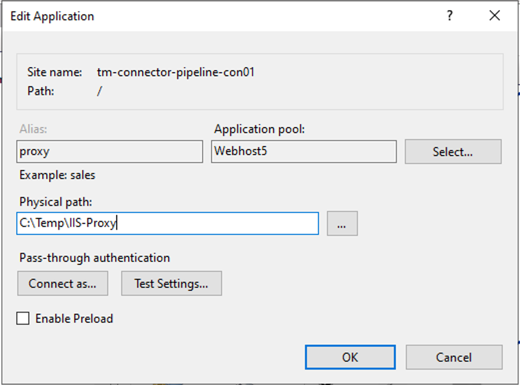
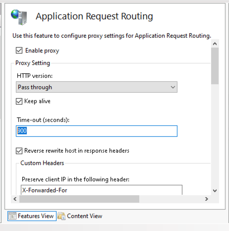

# IIS-proxy
Install ARR
https://www.iis.net/downloads/microsoft/application-request-routing

Install HTTP Redirections
Open Server Manager
Click Manage → Add Roles and Features
Go through: Role-based or feature-based
Select your server
Under Server Roles → Web Server (IIS):
Expand Web Server
Expand Common HTTP Features
Check: ✔ HTTP Redirect
Click Next → Install
Restart IIS if needed

Enable Redirection:
Application Request Routing -> Server Proxy Settings… nable Proxy

Create Web Application in IIS

Set IIS proxy timeout

